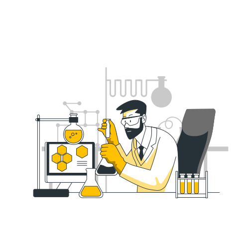

<div width="100%">

   <h2 align="center" style="font-weight: bold">Hey , I'm Kelviny </h2>
</br> 
</br> 


  </br> </br> 
  <h2 align="center"> 👨‍💻 Whoami</h2>
    </br>
<p>I'm a Full Stack developer, I love working with challenging and creative projects.</br>
As a programmer, I am constantly looking for best practices and also trying new things.</br>
I love working and collaborating with teams and, in my free time, I like to develop projects, you can check some of these projects here 🙃</p>
 <p align="center"  style="margin-top:-50px;">
 
 <blockquote><p align="center" style="margin-top:-60px;font-weight: 600;">The important thing is not to stop questioning; curiosity has its own reason for existing.</p></blockquote>
</p>
</br> 

## Trophies 🏆
---


<br/>

 <p align="center">
 
## Stats 📈
---


</tr>
    
<table align="center" cellspacing="0" cellpadding="0" border="0">
   <tr>
    <td>
      <a href="#" target="_blank">
       
      <a/>
    </td>
    <td>
      <a href="#" target="_blank">
        
      <a/>
    </td>
   </tr>
  <tr>
  <tr>
    <td>
      <a href="#" target="_blank">
        
      <a/>
    </td>
    <td>
      <a href=#" target="_blank">
        
      <a/>
    </td>
   </tr>
</table>
      
---
</p>

## 🧐 More About Me:
<br/>

- 🔭 &nbsp; I’m currently working on [Farmbox](https://github.com/Space-Monkeys/FarmBox_Firmware_V2)
- 🌱 &nbsp;   I’m currently learning Cypress 
- 👨🏻‍💻 &nbsp; Most of my projects are available on [Github](https://github.com/KelvinyHenrique?tab=repositories)
- 💬 &nbsp; Ask me about anything tech related, I am happy to help;
- 📫 &nbsp; Feel free to ping me on [LinkedIn](https://www.linkedin.com/in/kelvinyhenrique/)
- 📝 &nbsp; Checkout my [resume](https://drive.google.com/file/d/1UTN3Y06EW8_sqlAELlj86K2Dn8QODAr2/view?usp=sharing)
- 📚 &nbsp; When I'm free, I like to develop projects with microcontrollers and IOT.
</br></br>


```javascript
const kelviny = {
  hobbies: [Iot, Rockets, Mechanics, Astronomy],
  code: [Javascript, C++, Html, Css, Python, Php],
  frameworks: [Laravel, VueJS, React, React Native, Node],
  tools: [Figma, Adobe Illustrator],
  techCommunities: {
                        frontend: "Ukecode",
                        cofounder: "SpaceMonkeys",
                      },
}
```

  
</div>
